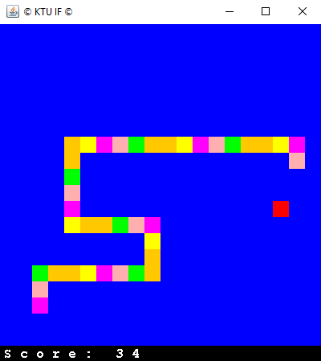

# B. Vizualios struktūros
## Užduotis
Sudaryti naują projektą, skirtą vizualių struktūrų apdorojimui. Galimos tematikos:
* pirmo kurso uždaviniai su langeliais dvimatėje erdvėje;
* ornamentų konstravimo eksperimentai, labirintai;
* paprasti žaidimai: kryžiukai- nuliukai, gyvatėlė, sokoban, akis (su kortomis) ir pan.;
* šaškių ir šachmatų etiudai, išdėstymas lentoje;
* įvairių įvykių registravimas (pagal krepšinio tablo pavyzdį).
## Individualiai pasirinkta užduotis
Sukūrti žaidimą – gyvatėlė.
* Gyvatėlė renka raudonus taškučius atsirandančius atsitiktinėse vietose
* Paėmus tašką gyvatėlė padidėja vienu tašku
* Gyvatėlė atsitrenkusi į save “Suvalgo” savo uodegą ir sumažėja
* Gyvatėlė atsitrenkus į sieną atsiranda kitoje žemėlapio pusėje

## Sprendimas
* FancyGame – Pagrindinė žaidimo klasė
* Snake – Gyvatėlės klasė
* Block – Žaidimo objekto (Blokelio) klasė

## Rezultatai
Realizuoto žaidimo nuotrauka:

Demonstracinis video: https://youtu.be/Gh_whnCX9t4
